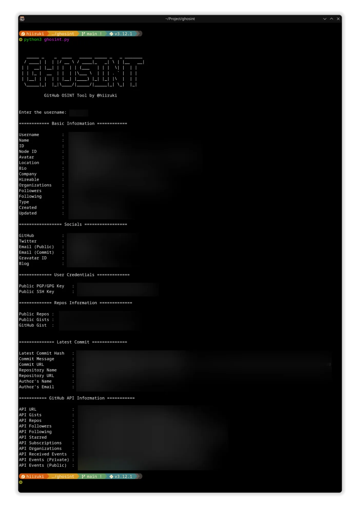

<p align="center">
  
</p>

## INSTALLATION

1. Clone this repo

    `git clone https://github.com/hiiruki/ghosint.git`

2. Navigate to the directory

    `cd ghosint`

3. Create a virtual environment for this project

    `python3 -m venv venv`

    \* If you don't have `venv` installed, you can install it by running `python3 -m pip install virtualenv`

4. Load the virtual environment
   - On Windows Powershell: `.\venv\Scripts\activate.ps1`
   - On Linux and Git Bash: `source venv/bin/activate`
  
5. Run `pip install -r requirements.txt` to install the required packages

### TROUBLESHOOTING

If you encounter any issues while installing the required packages, you can try the following:

- Install pip using the following command:

    `sudo apt install python3-pip`

- Install virtualenv using the following command:

    `python3 -m pip install virtualenv`

- If some library/dependency is not installed or missing, you can install it using the following command:

    `pip install -r requirements.txt`

- If venv is still error maybe your ensurepip is not installed, you can install it using the following command:

    `apt install python3.10-venv`

    \* Replace `python3.10` with your python version.

## CONFIGURATION

> [!NOTE]
> GitHub API Token is required to use this tool. You can use the [Personal access tokens (classic)](https://github.com/settings/tokens) or  [Fine-grained personal access tokens (beta)](https://github.com/settings/tokens?type=beta).

Make sure to setup your GitHub API Token in the `.env` file before running the tool by simply creating a `.env` file in the root directory of the project and adding the following line to it:

``` bash
GITHUB_TOKEN=<your_github_api_token>
```

and save the file as `.env` in the root directory of the project.

or you can use the following command to create the `.env` file:

``` bash
echo "GITHUB_TOKEN=<your_github_api_token>" > .env
```

*Replace `<your_github_api_token>` with your GitHub API Token.

Supported types of personal access tokens:

- Fine-grained tokens (beta) *recommended and used in examples above
- Tokens (classic)

## USAGE

``` bash
python3 ghosint.py
```

When you run the tool, it will prompt you to enter the GitHub username of the user you want to inspect.

## FEATURES

<details><summary> Tool Features </summary>

- Basic Information
  - Username
  - Name
  - ID
  - Node ID
  - Avatar URL
  - Location
  - Bio
  - Company
  - Hireable
  - Organizations
  - Followers
  - Following
  - Type
  - Created
  - Updated
- Socials
  - Email (Public)
  - Email (Commit)
  - Gravatar ID
  - Blog
  - GitHub Pages
  - Twitter
  - Facebook
  - Instagram
  - Linkedin
  - Mastodon
  - Reddit
  - Twitch
  - Youtube
  - Hometown
  - Generic (Custom)
- User Credentials
  - Public PGP/GPG Key
  - Public SSH Key
- Repos Information
  - Public Repos
  - Public Gists
  - GitHub Gist
- Latest Commit
  - Latest Commit Hash
  - Commit Message
  - Commit URL
  - Commit API URL
  </details>

## DEPENDENCIES

- requests
- python-dotenv

(see [requirements.txt](./requirements.txt) for more details)

## SCREENSHOT



## ISSUES & CONTRIBUTING

> [!NOTE]
> Please make sure to read the full guidelines. Your issue may be closed without warning if you do not.

<details><summary>Issues</summary>

**Before reporting a new issue, take a look at the already opened [issues](https://github.com/hiiruki/ghosint/issues).**

</details>

<details><summary>Contributing</summary>

See [CONTRIBUTING.md](./CONTRIBUTING.md).
</details>

<details><summary>Code of Conduct</summary>

See [CODE_OF_CONDUCT.md](./CODE_OF_CONDUCT.md).
</details>

## DISCLAIMER

This tool is intended for educational and research purposes only. The author does not hold any responsibility for the misuse of this tool.

## LICENSE

This software is licensed under the terms of the [MIT License](./LICENSE.md).
